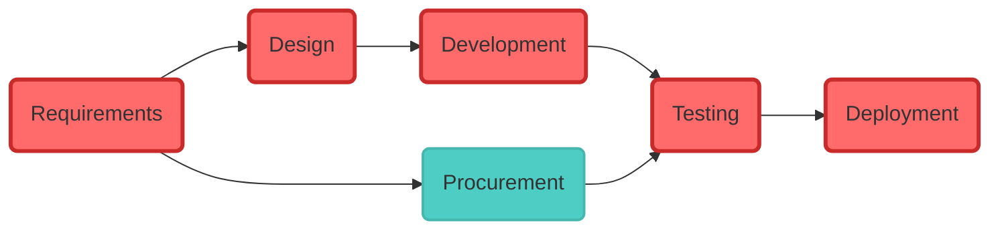

```mermaid
flowchart LR
    A(Requirements)
    B(Design)
    C(Procurement)
    D(Development)
    E(Testing)
    F(Deployment)
    A --> B
    A --> C
    B --> D
    D --> E
    C --> E
    E --> F
    classDef critical fill:#ff6b6b,stroke:#c92a2a,stroke-width:3px
    class A,B,D,E,F critical
    classDef normal fill:#4ECDC4,stroke:#45B7AF,stroke-width:2px
    class C normal
```