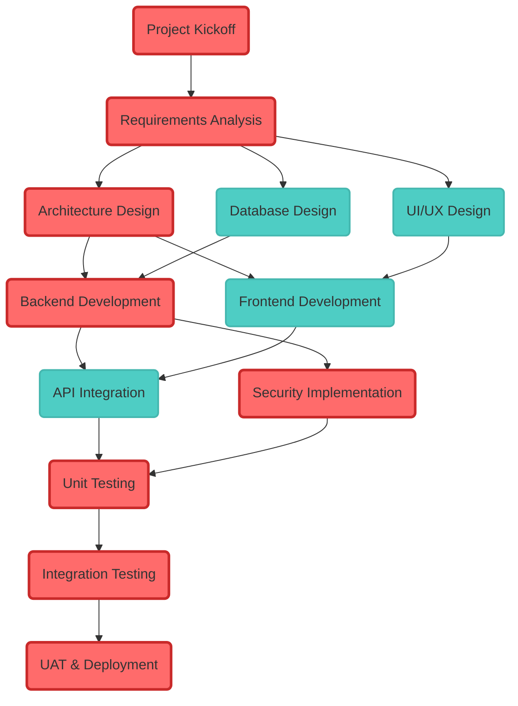

```mermaid
flowchart TB
    A(Project Kickoff)
    B(Requirements Analysis)
    C(Architecture Design)
    D(Database Design)
    E(UI/UX Design)
    F(Backend Development)
    G(Frontend Development)
    H(API Integration)
    I(Security Implementation)
    J(Unit Testing)
    K(Integration Testing)
    L(UAT & Deployment)
    A --> B
    B --> C
    B --> D
    B --> E
    C --> F
    D --> F
    C --> G
    E --> G
    F --> H
    G --> H
    F --> I
    H --> J
    I --> J
    J --> K
    K --> L
    classDef critical fill:#ff6b6b,stroke:#c92a2a,stroke-width:3px
    class A,B,C,F,I,J,K,L critical
    classDef normal fill:#4ECDC4,stroke:#45B7AF,stroke-width:2px
    class D,E,G,H normal
```