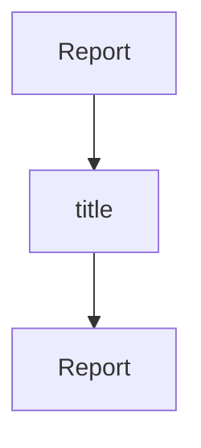
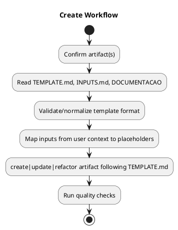

# PMBOK Export Analysis & Enhancement Plan

## 🐛 Current Issues

### Issue 1: PlantUML Object Diagram Not Useful
**Problem:** Generic object diagram shows data structure, not PM information
**Current output:**
```plantuml
@startuml
object "Report" as root
object "title" as root_title
object "Report" as root_title_value  ← Confusing duplication
root --> root_title
root_title --> root_title_value
@enduml
```

**Why it's wrong:**
- Creates nodes for every dict key/value pair
- Not suitable for project management visualizations
- Doesn't convey workflow, process, or project structure

### Issue 2: Mermaid Generic Tree Diagram
**Problem:** Similar to PlantUML - shows data structure, not PM concepts
**Current output:**


**Why it's limited:**
- Tree structure doesn't represent workflows
- No support for Gantt, sequence, or activity diagrams
- Missing PM-specific visualizations

## ✅ Proposed Enhancements

### 1. Workflow Checklist → Activity Diagram (PlantUML)


### 2. Workflow Checklist → Flowchart (Mermaid)
```mermaid
flowchart TD
    Start([Start Create Workflow])
    Step1[Confirm artifact]
    Step2[Read TEMPLATE.md, INPUTS.md, DOCUMENTACAO]
    Step3[Validate/normalize template format]
    Step4[Map inputs from user context]
    Step5[create|update|refactor artifact]
    Step6[Run quality checks]
    End([End])

    Start --> Step1
    Step1 --> Step2
    Step2 --> Step3
    Step3 --> Step4
    Step4 --> Step5
    Step5 --> Step6
    Step6 --> End
```

### 3. Quality Audit → Class Diagram (PlantUML)
For structured artifact analysis

### 4. Artifact Mapping → Sequence Diagram
For showing artifact relationships and dependencies

## 📋 Implementation Plan

1. **Create `pmbok_exporters.py`** - Specialized export functions
2. **Enhanced output types:**
   - Workflow → Activity diagram / Flowchart
   - Audit results → Class diagram / Table
   - Artifact relationships → Sequence diagram / Graph
3. **Update `pmbok_utils.py`** to use enhanced exporters
4. **Create advanced integration tests**
5. **Document in README.md**

## 🎯 Success Criteria

- ✅ PlantUML generates meaningful PM diagrams (not generic objects)
- ✅ Mermaid uses appropriate diagram types (flowchart, Gantt, etc.)
- ✅ All diagrams render without syntax errors
- ✅ Integration tests validate real outputs
- ✅ Examples demonstrate PMBOK PM use cases

---

**Generated:** 2026-02-05
**License:** MIT
