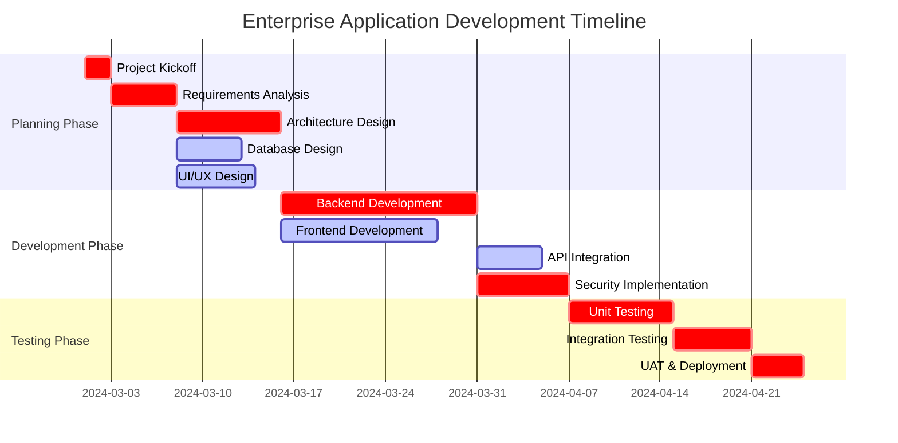

```mermaid
gantt
    title Enterprise Application Development Timeline
    dateFormat YYYY-MM-DD
    section Planning Phase
    Project Kickoff :crit, A, 2024-03-01, 2024-03-03
    Requirements Analysis :crit, B, 2024-03-03, 2024-03-08
    Architecture Design :crit, C, 2024-03-08, 2024-03-16
    Database Design :active, D, 2024-03-08, 2024-03-13
    UI/UX Design :active, E, 2024-03-08, 2024-03-14
    section Development Phase
    Backend Development :crit, F, 2024-03-16, 2024-03-31
    Frontend Development :active, G, 2024-03-16, 2024-03-28
    API Integration :active, H, 2024-03-31, 2024-04-05
    Security Implementation :crit, I, 2024-03-31, 2024-04-07
    section Testing Phase
    Unit Testing :crit, J, 2024-04-07, 2024-04-15
    Integration Testing :crit, K, 2024-04-15, 2024-04-21
    UAT & Deployment :crit, L, 2024-04-21, 2024-04-25
```