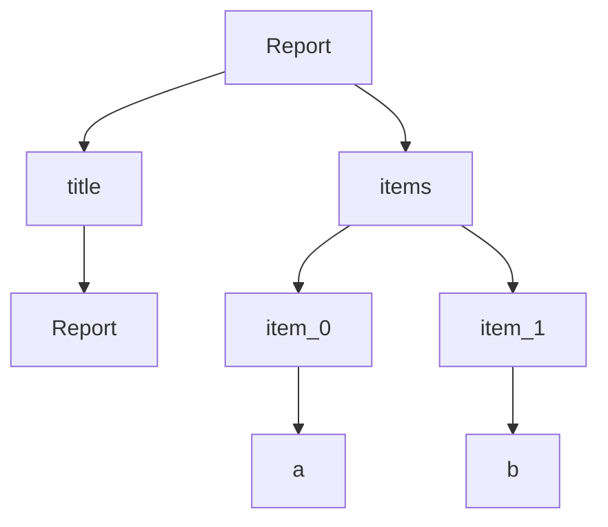

```mermaid
graph TD
  root["Report"]
  root_title["title"]
  root_title_value["Report"]
  root_items["items"]
  root_items_item_0["item_0"]
  root_items_item_0_value["a"]
  root_items_item_1["item_1"]
  root_items_item_1_value["b"]
  root --> root_title
  root_title --> root_title_value
  root --> root_items
  root_items --> root_items_item_0
  root_items_item_0 --> root_items_item_0_value
  root_items --> root_items_item_1
  root_items_item_1 --> root_items_item_1_value
```